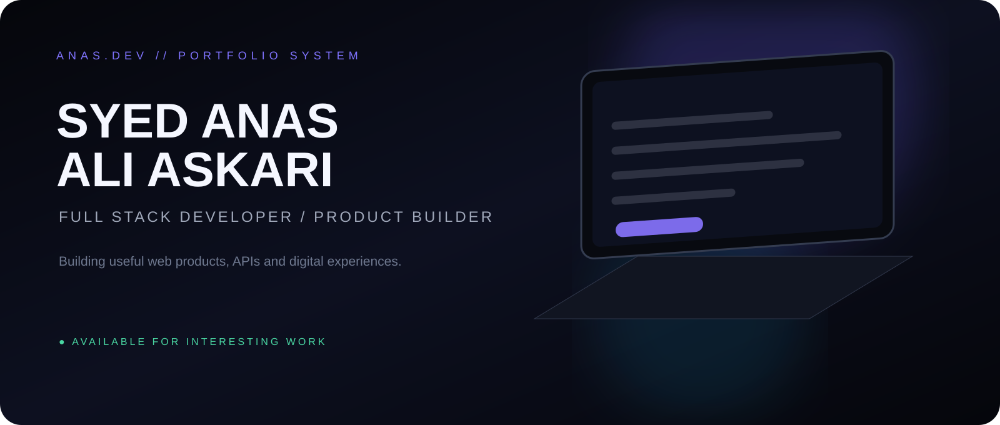
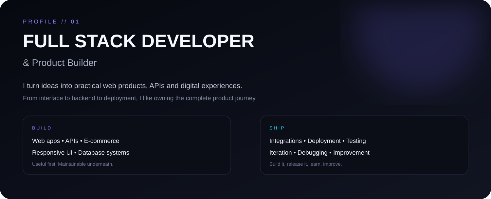
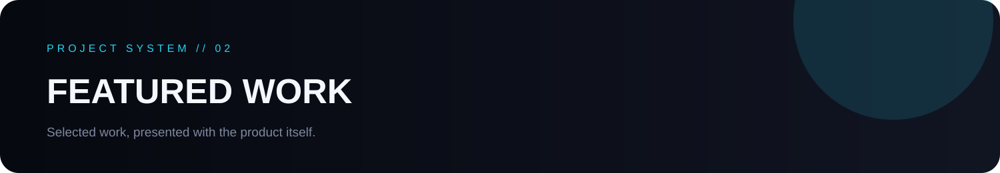
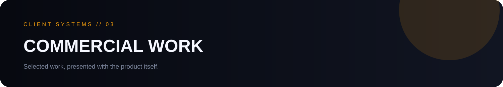
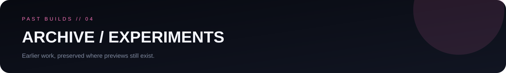
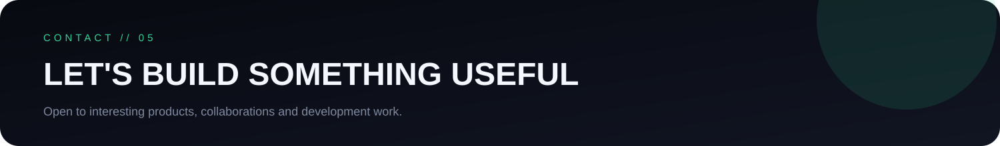

  

  <a href="#about">ABOUT</a> &nbsp;•&nbsp;
  <a href="#featured">FEATURED</a> &nbsp;•&nbsp;
  <a href="#commercial">COMMERCIAL</a> &nbsp;•&nbsp;
  <a href="#archive">ARCHIVE</a> &nbsp;•&nbsp;
  <a href="#contact">CONTACT</a>

---

I'm **Syed Anas Ali Askari**, a Full Stack Developer & Product Builder focused on turning ideas into clean, practical web products.

I work across the full product lifecycle: shaping an idea, designing the experience, building frontend and backend systems, integrating APIs, working with databases, deploying applications, and improving what ships.

<table>
<tr>
<td width="50%" valign="top">

**What I build**

- Full-stack web applications
- REST APIs & backend systems
- E-commerce & business platforms
- Responsive user interfaces

</td>
<td width="50%" valign="top">

**How I work**

- Product-first thinking
- Clean, maintainable architecture
- Real-world deployment
- Continuous iteration

</td>
</tr>
</table>

---

## LendAFile
**File Sharing & Productivity Platform**

A file-sharing product built around **Rooms, Quick Share, Quick Request and browser-based tools**.

<b>View project details</b>

 
`Rooms` · `Quick Share` · `Quick Request` · `File Tools` · `QR Sharing` · `Password Protection`

 

## Currency Converter
**React + NestJS Full-Stack Application**

Mobile-first currency conversion with **live/historical rates, persistent history and secure server-side API integration**.

---

<table>
<tr>
<td width="50%" valign="top">

### Miral Interior
**Interior Design & E-Commerce**

A polished commercial web experience for an interior-design brand.

</td>
<td width="50%" valign="top">

### Ewoke Vapes
**E-Commerce**

Product-focused commercial storefront and e-commerce experience.

</td>
</tr>
</table>

### Reinziel Biotech
**Biotechnology Web Project**

Professional biotechnology web presence with a clear, business-focused presentation.

### More commercial work

`Zloxs Pharma` · `Anxionyx Clinic` · `Beethovmed Biotech` · `Nexnos Pharma`

---

<table>
<tr>
<td width="50%" valign="top">

**Trademark Counsel**

[Preview ↗](https://trademarketing.netlify.app/)

</td>
<td width="50%" valign="top">

**AMZ Automation**

[Preview ↗](https://amzautomation.netlify.app/)

</td>
</tr>
<tr>
<td width="50%" valign="top">

**Spark Digital Technologies**

[Preview ↗](https://4edgesolutions.netlify.app/)

</td>
<td width="50%" valign="top">

**Saxon Digital Technologies**

[Preview ↗](https://saxondigitaltechnologies.netlify.app/)

</td>
</tr>
</table>

<b>More archived work</b>

 
`Miral Fashions` · `Norvatis Biotech` · `Coupon20`

---

### Let's build something useful.

&nbsp;

