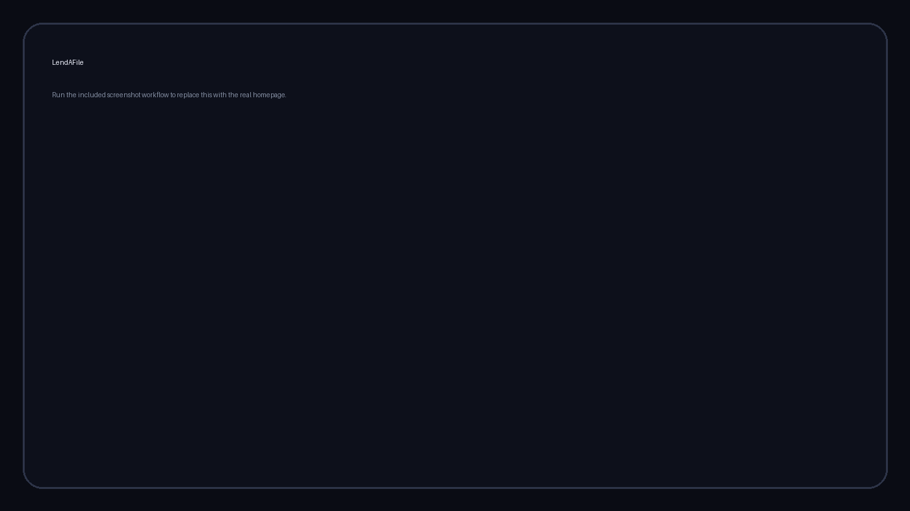
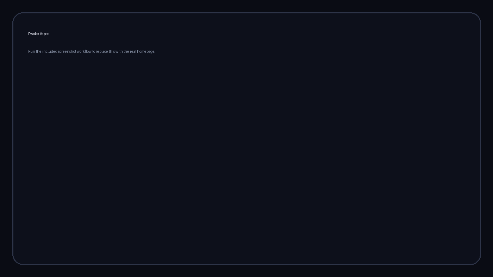
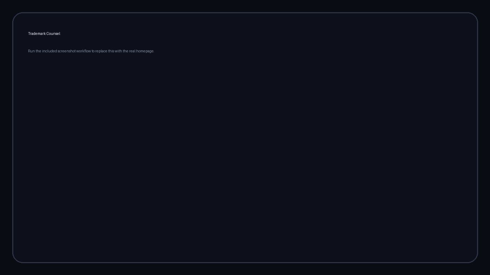
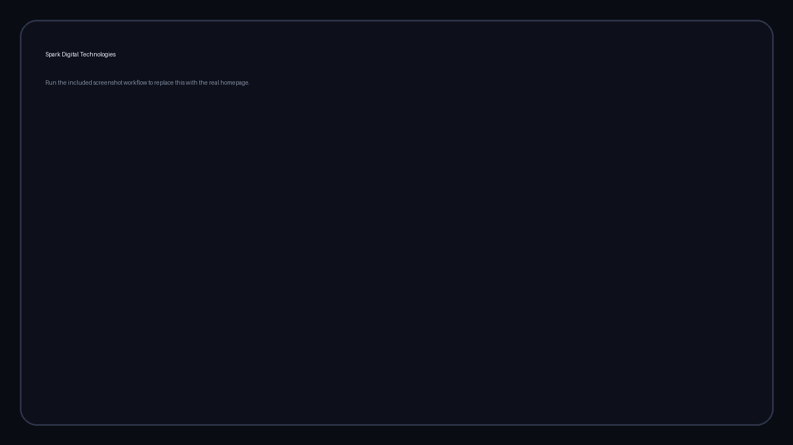

<a href="#about">ABOUT</a> &nbsp;•&nbsp; <a href="#featured">FEATURED</a> &nbsp;•&nbsp;
<a href="#commercial">COMMERCIAL</a> &nbsp;•&nbsp; <a href="#archive">ARCHIVE</a> &nbsp;•&nbsp; <a href="#contact">CONTACT</a>

## LendAFile
**File Sharing & Productivity Platform**

Temporary file sharing built around **Quick Share, Quick Request and collaborative Rooms**, with browser tools and automatic expiry.

  

## Currency Converter
**React + NestJS Full-Stack Application**

Mobile-first conversion with **live and historical rates**, local history and a backend API layer.

<table>
<tr>
<td width="50%" valign="top">
<h3>Miral Interior</h3>

Interior design &amp; e-commerce experience.

<a href="https://miralinterior.com/">Visit website ↗</a>
</td>
<td width="50%" valign="top">
<h3>Ewoke Vapes</h3>

Product-focused e-commerce storefront.

<a href="https://ewokevapes.com/">Visit website ↗</a>
</td>
</tr>
</table>

### Reinziel Biotech

Business-focused biotechnology web presence.

<a href="https://reinzielbiotech.com/">Visit website ↗</a>

<b>More commercial work</b>
 
Zloxs Pharma · Anxionyx Clinic · Beethovmed Biotech · Nexnos Pharma

<table>
<tr>
<td width="50%" valign="top"><b>Trademark Counsel</b>   <a href="https://trademarketing.netlify.app/">Preview ↗</a></td>
<td width="50%" valign="top"><b>AMZ Automation</b>   <a href="https://amzautomation.netlify.app/">Preview ↗</a></td>
</tr>
<tr>
<td width="50%" valign="top"><b>Spark Digital Technologies</b>   <a href="https://4edgesolutions.netlify.app/">Preview ↗</a></td>
<td width="50%" valign="top"><b>Saxon Digital Technologies</b>   <a href="https://saxondigitaltechnologies.netlify.app/">Preview ↗</a></td>
</tr>
</table>

### Let's build something useful.

&nbsp;

