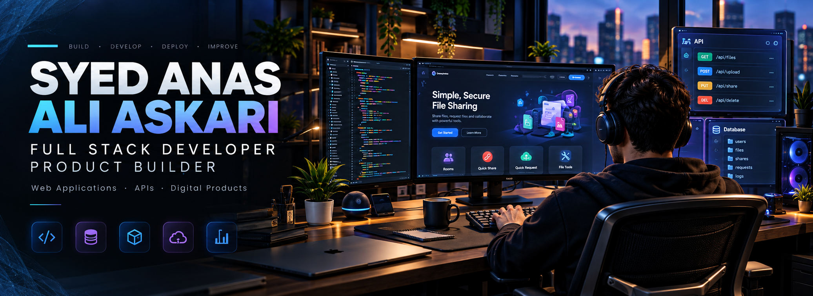
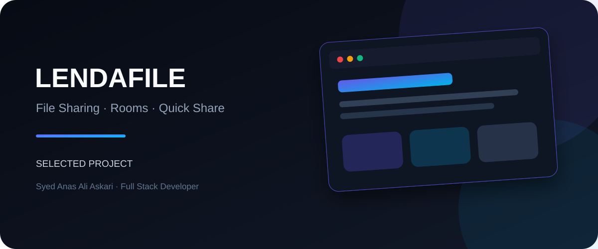
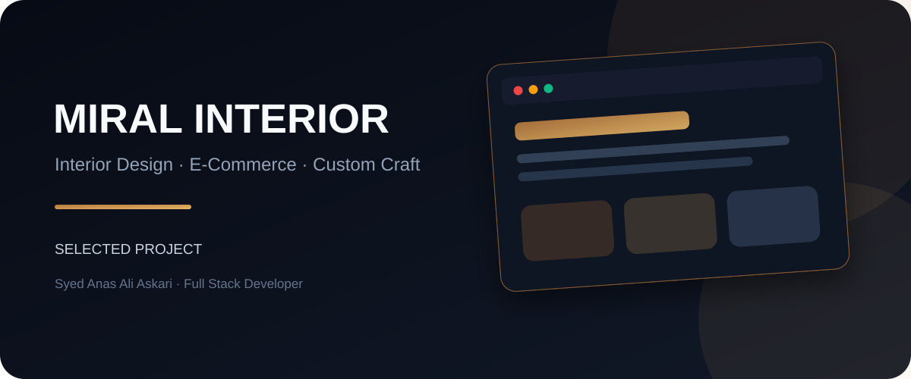
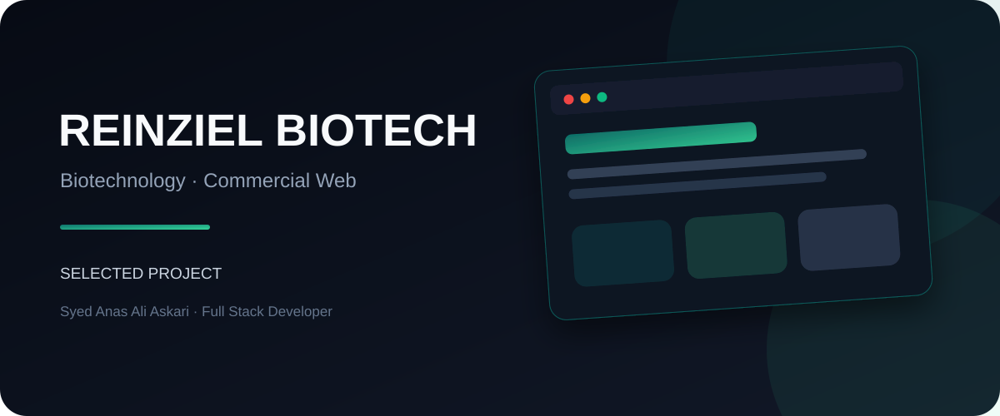
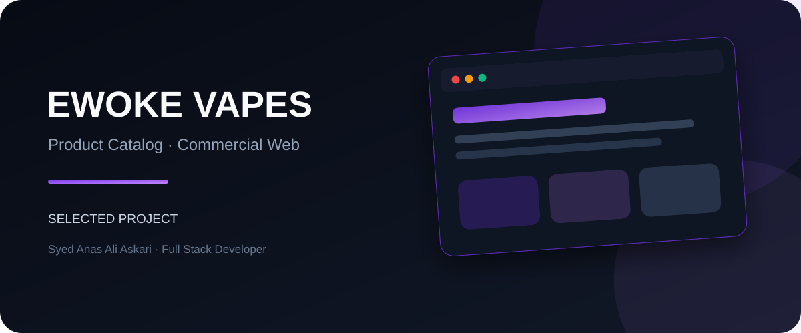

  

  
  

Karachi, Pakistan · Full Stack Development · Product Engineering · Web Applications & APIs

---

## About Me

I'm **Syed Anas Ali Askari**, a Full Stack Developer and Product Builder focused on turning ideas into polished, production-ready web experiences.

I work across the full product lifecycle: shaping interfaces, building responsive frontends, designing backend systems and APIs, working with databases, integrating third-party services, deploying applications, and improving them after launch. My projects span file-sharing utilities, SaaS-style products, e-commerce, business systems, healthcare and biotech websites, and experimental product concepts.

What matters most to me is not adding technology for decoration. I like **clean interfaces, maintainable systems, sensible architecture, and products that solve an actual problem**.

<table>
<tr>
<td width="25%" align="center"><b>Web Apps</b> Responsive product experiences</td>
<td width="25%" align="center"><b>APIs & Backend</b> Services, integrations & logic</td>
<td width="25%" align="center"><b>Product Building</b> Idea → prototype → production</td>
<td width="25%" align="center"><b>Deployment</b> Shipping & maintaining products</td>
</tr>
</table>

---

## Technology

**Frontend**

  

**Backend · Database · Tools**

 
Node.js · NestJS · PHP · MySQL · Git · GitHub · Netlify

---

# Featured Work

### LendAFile

**File Sharing & Productivity Platform**

A temporary file-sharing platform built around low-friction workflows including Rooms, Quick Share and Quick Request, with QR sharing, optional password protection and automatic expiry. citeturn0search2

`Rooms` · `Quick Share` · `Quick Request` · `File Tools` · `QR Sharing` · `Analytics`

 

<table>
<tr>
<td width="50%" valign="top">

### Currency Converter

**React + NestJS Full-Stack Application**

Mobile-first currency conversion with live/historical rates, persistent history and a backend proxy for API credentials.

`React` · `TypeScript` · `NestJS` · `REST API`

</td>
<td width="50%" valign="top">

### Miral Interior

**Interior Design & E-Commerce**

Commercial design platform covering interior services, custom material work, portfolio content and online products. citeturn0search0turn0search4

`Commercial` · `E-Commerce` · `Private Source`

</td>
</tr>
</table>

<table>
<tr>
<td width="50%" valign="top">

### Reinziel Biotech

**Biotechnology Web Project**

A commercial web presence created for a biotechnology business with a focus on professional presentation and clear brand communication.

</td>
<td width="50%" valign="top">

### Ewoke Vapes

**Product & E-Commerce Website**

A product-focused commercial website presenting Ewoke's product portfolio and brand catalog. citeturn0search3

`Commercial` · `Product Catalog` · `Private Source`

</td>
</tr>
</table>

---

## Selected Commercial Work

<table>
<tr>
<td width="20%" align="center"><b>Zloxs Pharma</b> Pharmaceutical  </td>
<td width="20%" align="center"><b>Anxionyx Clinic</b> Healthcare  </td>
<td width="20%" align="center"><b>Beethovmed</b> Biotechnology  </td>
<td width="20%" align="center"><b>Nexnos Pharma</b> Pharmaceutical  </td>
<td width="20%" align="center"><a href="https://www.ewokevapes.com/pages/products.php"><b>Ewoke Vapes</b></a> E-Commerce  </td>
</tr>
</table>

---

## Archive & Experiments

<table>
<tr>
<td width="25%" valign="top"><b>Trademark Counsel</b> Legal & professional services  </td>
<td width="25%" valign="top"><b>AMZ Automation</b> Amazon-oriented business project  </td>
<td width="25%" valign="top"><b>Spark Digital</b> Digital technology & services  </td>
<td width="25%" valign="top"><b>Saxon Digital</b> Digital technology & services  </td>
</tr>
</table>

Additional past work: Miral Fashions · Norvatis Biotech · Coupon20

---

## Latest Public Repositories

<!-- AUTO-REPOS:START -->
This section is automatically refreshed by the included GitHub Action.
<!-- AUTO-REPOS:END -->

---

# Let's Build Something Useful.

**Open to interesting products, collaborations and development opportunities.**

 

  
Syed Anas Ali Askari · Full Stack Developer & Product Builder

